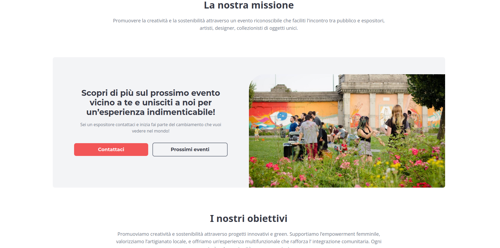
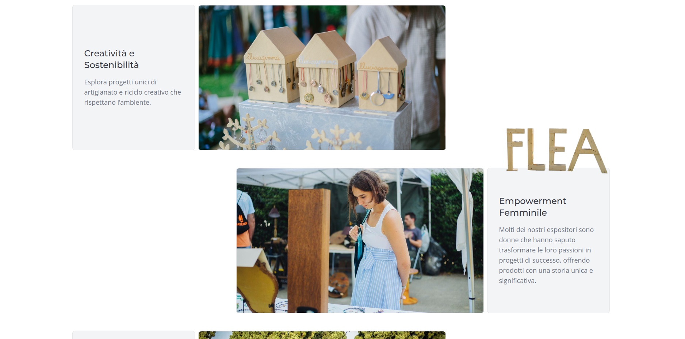
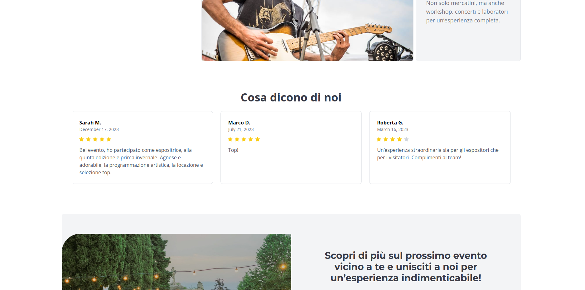
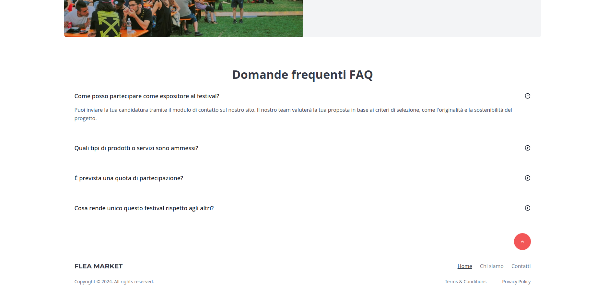

# FleaMarket Landing Page
- A landing page for a traveling markets and festivals business, featuring sections such as Hero, Mission, Goals, Reviews, Call to Action, FAQ, About, and Contact pages. Built using HTML, CSS, and TailwindCSS for a clean and responsive design.
- Demo: https://demo2.isaccobertoli.com

## Tech Stack

- Html
- Tailwind CSS
- Javascript

## Screenshots

    

    

    

    

    

    

## 🔗 Links

